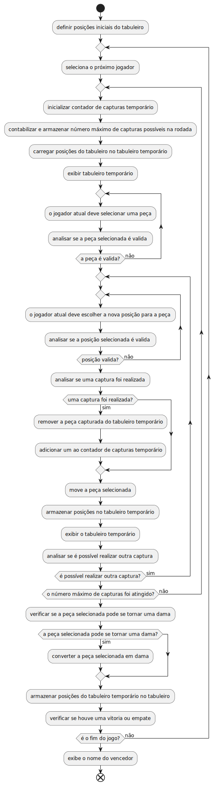
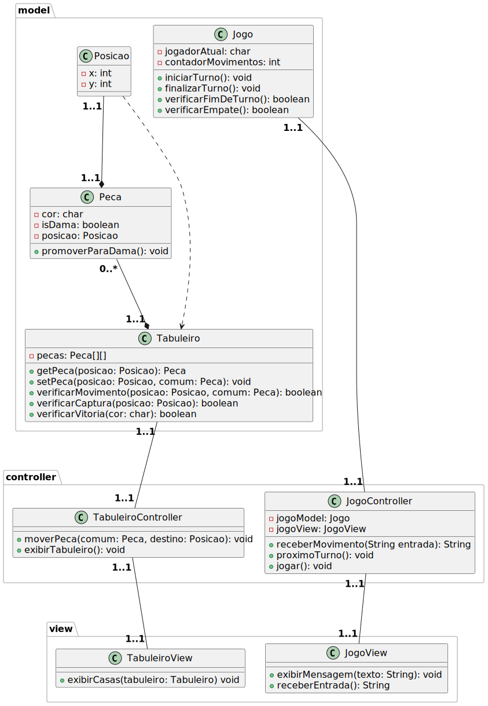

# Jogo De Damas

## Descrição

Jogo de damas feito durante a materia de Programação Orientada a Objetos do curso de Engenharia de Computação no CEFETMG.

## Diagrama de Atividades

    

## Diagrama de Classes

    

