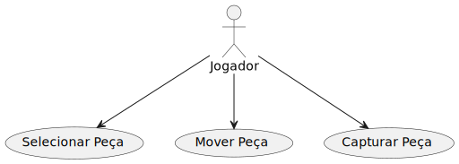
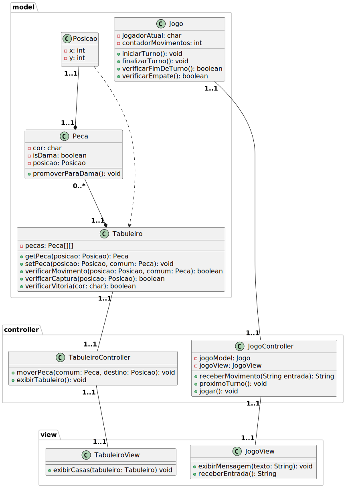

# Jogo De Damas

Jogo de damas feito durante a materia de Programação Orientada a Objetos no curso de Engenharia de Computação do CEFET-MG.

## Diagrama de Caso de Uso

    

## Diagrama de Atividades

    

## Diagrama de Classes

    

